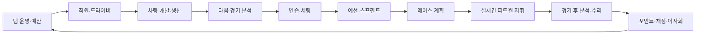
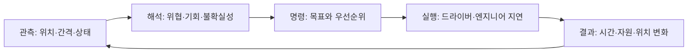
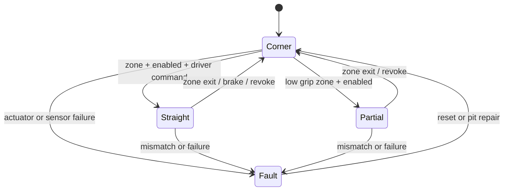
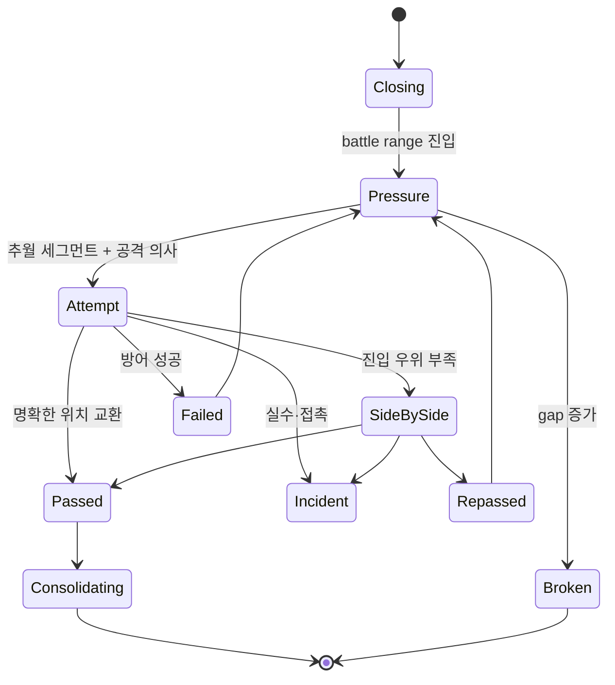
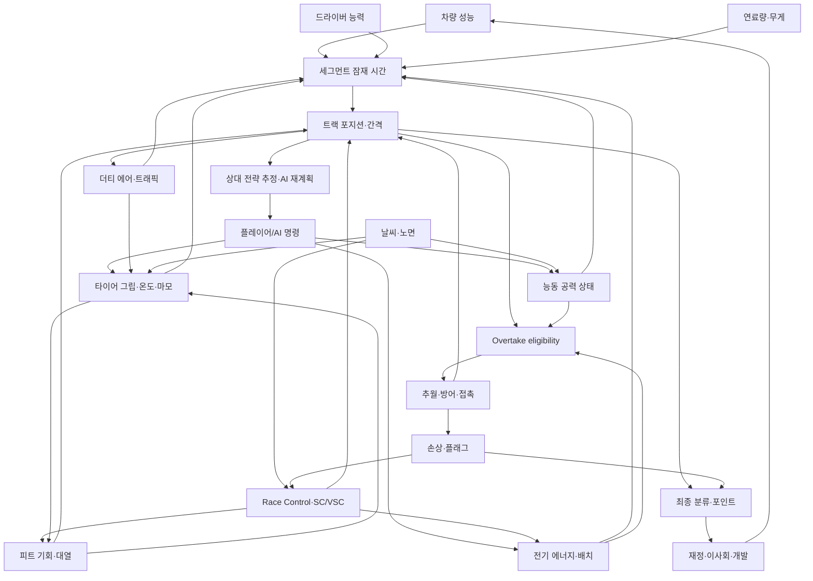

# PROJECT PITWALL — 2026 실시간 F1 감독 시뮬레이션 게임 설계서

> 문서 상태: Pre-production GDD / Systems Design Framework 1.0
> 기준일: 2026-07-12 (Asia/Seoul)
> 규정 기준: FIA 2026 F1 Regulations — Section A Issue 03, B Issue 07, C Issue 19, D Issue 07 (각 2026-06-25 발행)
> 제품 원칙: **레이스 화면 우선, 데이터 기반 규정, 결정론적 실시간 시뮬레이션, 공식 데이터 비종속**

---

## 문서 사용법과 설계 경계

이 문서는 전체 게임을 구현하는 코드 명세가 아니라, 프로듀서·게임 디자이너·레이스 시스템 디자이너·UI/UX 디자이너·클라이언트 및 시뮬레이션 엔지니어가 같은 제품을 만들기 위한 기준선이다.

- **확정 규정**은 FIA 발행본에 근거한다.
- **경기별 지시값**은 FIA가 별도 통지하는 활성 구간·Detection Gap·에너지 제한처럼 변경 가능한 데이터로 취급한다.
- **게임 모델**은 실제 규정이 명시하지 않는 재미·가독성·불확실성 모델이다.
- **MVP 값**은 밸런싱을 위한 시작점이지 실제 F1 성능 수치라고 주장하지 않는다.
- 실제 팀명·드라이버명·로고·서킷 형상·방송 그래픽·Formula 1 상표는 기본 빌드에 포함하지 않는다. 기본 콘텐츠는 가상 챔피언십이며, 공식 데이터는 사용자가 합법적으로 보유한 팩을 로드하는 호환 계층으로 분리한다.

### 공식 근거 자료

- [FIA 2026 Formula 1 General Regulatory Provisions, Section A Issue 03](https://www.fia.com/system/files/documents/fia_2026_f1_regulations_-_section_a_general_provisions_-_iss_03_-_2026-06-25.pdf)
- [FIA 2026 Formula 1 Sporting Regulations, Section B Issue 07](https://www.fia.com/system/files/documents/fia_2026_f1_regulations_-_section_b_sporting_-_iss_07_-_2026-06-25.pdf)
- [FIA 2026 Formula 1 Technical Regulations, Section C Issue 19](https://www.fia.com/system/files/documents/fia_2026_f1_regulations_-_section_c_technical_-_iss_19_-_2026-06-25.pdf)
- [FIA 2026 Formula 1 Financial Regulations, Section D Issue 07](https://www.fia.com/system/files/documents/fia_2026_f1_regulations_-_section_d_financial_-_f1_teams_-_iss_07_-_2026-06-25.pdf)
- [Formula 1 공식 2026 규정 및 신용어 설명](https://corp.formula1.com/f1-2026-regulations-terminology-update/)
- [Formula 1 공식 2026 규정 개요](https://www.formula1.com/en/latest/article/everything-you-need-to-know-about-the-new-f1-rules-for-2026.48bv0VTxhIlhrQXmxercXk)
- [FIA의 Cadillac 11번째 팀 승인 설명](https://www.fia.com/news/cadillac-f1-how-fia-paved-way-11th-team-formula-1)
- [Formula 1 공식 Audi 팀 소개](https://www.formula1.com/en/teams/audi)
- [Formula 1 공식 2026 경기 캘린더](https://www.formula1.com/en/racing/2026)

---

## 1. 게임 제목 후보 10개

상표 충돌 및 스토어 검색 가능성을 별도 조사해야 하며, 아래는 콘셉트 단계의 워킹 타이틀이다.

| 순위 | 제목 | 전달하는 이미지 | 메모 |
|---:|---|---|---|
| 1 | **Project Pitwall** | 피트월 자체가 주인공 | 개발 코드명과 제품명 모두 적합 |
| 2 | **Race Control: Team Principal** | 통제와 권한 | 장르가 즉시 읽힘 |
| 3 | **Twenty-Two** | 22대 전체를 보는 독창성 | 미니멀하고 기억하기 쉬움 |
| 4 | **The Undercut** | 전략이 결과를 바꾸는 순간 | 모터스포츠 팬 친화적 |
| 5 | **Pitwall Command** | 실시간 명령과 압박 | 군사적이지만 명확함 |
| 6 | **Apex Directive** | 기술적이고 미래적인 톤 | 공력·에너지 시대에 어울림 |
| 7 | **Delta One** | 타이밍 델타와 1초 조건 | 짧고 UI 브랜드화 쉬움 |
| 8 | **Strategic Window** | 피트윈도우와 판단 | 분석 중심 정체성 |
| 9 | **Grid Architect** | 팀을 장기적으로 설계 | 커리어 계층 강조 |
| 10 | **Command the Circuit** | 트랙 전체 지휘 | 대중적이고 직접적 |

이 문서에서는 **Project Pitwall**을 사용한다.

---

## 2. 게임의 핵심 비전

### 한 문장 소개

**22대가 연속적으로 움직이는 중앙 트랙 맵을 읽고, 두 드라이버의 타이어·에너지·공력·피트 전략을 실시간 지휘해 수년간 팀을 정상으로 이끄는 피트월 감독 시뮬레이션.**

### 핵심 플레이 판타지

플레이어는 운전자가 아니라 **결정의 설계자**다. 제한된 정보와 불완전한 예측 속에서 “지금 피트인가, 한 랩 연장인가”, “이번 직선에서 공격할 것인가, 다음 랩을 위해 충전할 것인가”를 몇 초 안에 정한다. 좋은 전략은 느린 차로도 빠른 차를 이기게 하고, 나쁜 호출은 우승 후보를 트래픽에 묻는다.

### 목표 플레이어

- F1 방송의 타이밍 타워·온보드보다 전략 상황을 더 오래 보는 팬
- Football Manager, Motorsport Manager, RimWorld, Paradox 계열의 인과적 시뮬레이션을 좋아하는 플레이어
- 복잡성은 원하지만 전문 용어를 외워야만 즐길 수 있는 게임은 원하지 않는 플레이어
- 20분짜리 단일 레이스부터 수십 시즌 커리어까지 자기 속도로 플레이하려는 PC 중심 사용자

### 감정 곡선

| 시점 | 목표 감정 | 만드는 시스템 |
|---|---|---|
| 경기 전 | 통제감과 불안 | 전략 A/B/C, 날씨 범위, 타이어 재고 |
| 스타트 | 긴장과 정보 과부하 | 22대 밀집, 자동 감속, 우선 경고 |
| 스틴트 중반 | 추리와 계획 | 페이스 추세, 상대 전략 추정, 피트 복귀 범위 |
| 피트윈도우 | 압박과 결단 | 언더컷 확률, 더블 스택 위험, 트래픽 |
| SC·비·고장 | 통제 상실과 재계획 | 즉시 재예측, 자동 일시정지, 엔지니어 제안 |
| 체커기 | 해방감 또는 후회 | 전략 타임라인과 “결정이 만든 시간” 분석 |
| 시즌 장기 | 소유감과 성취 | 인재·시설·차량 철학이 수년 후 성능으로 환류 |

### 현실성과 재미의 균형

1. **규칙은 사실적으로, 관측은 불완전하게, 입력은 감독답게** 설계한다.
2. 실제 ECU 버튼을 매 순간 누르게 하지 않고 공격 성향·목표 랩·우선순위를 지시한다.
3. 모든 차량 공학을 계산하지 않고 전략 결과에 영향이 큰 상태만 모델링한다.
4. 실제 데이터는 내부에서 연속값으로 계산하되 UI는 범위·위험도·신뢰도로 번역한다.
5. 낮은 난이도는 엔지니어가 이유와 권고를 말하고, 높은 난이도는 원시 데이터와 불확실성을 더 많이 남긴다.

### 비주얼 방향

“방송 화면을 흉내 낸 게임”이 아니라 **피트월·항공 관제·텔레메트리 랩이 합쳐진 운영 시스템**을 목표로 한다.

- 배경: 카본 블랙과 짙은 청회색, 눈의 피로를 줄이는 낮은 명도
- 정보 색: 상태를 뜻하는 제한된 색 체계(정상 청록, 주의 황색, 긴급 적색, 규정 보라)
- 팀 색: 순위 장식이 아니라 차량 식별에만 강하게 사용
- 타이포: 숫자 폭이 고정된 타이밍용 서체 + 읽기 쉬운 UI 서체
- 모션: 차량은 부드럽게, 경고는 짧고 즉시, 패널은 위치가 흔들리지 않게
- 효과: 비·사고·배틀은 지도 위에 절제된 레이어로 표현하고 정보 대비를 해치지 않음

### 사운드 방향

- 엔진 사운드는 위치·거리·배속에 따라 추상화된 앰비언스로 사용
- 핵심은 라디오 비프, 레이스 컨트롤 톤, 피트건, 경고 우선순위 사운드
- 한 이벤트당 한 개의 대표음만 재생하여 경고 폭주를 방지
- 4배속 이상에서는 지속 사운드를 단순화하고 중요 이벤트에서만 원래 템포로 복귀

---

## 3. 2026 시즌 기준 요약

### 3.1 검증된 기준선

| 항목 | 2026 기준 | 게임 적용 |
|---|---|---|
| 그리드 | Cadillac 합류로 11팀·22대, 팀당 2대 | 기본 `gridSize=22`, 확장 가능 |
| Audi | Sauber 인수 후 Audi 워크스 스쿼드 | 공식 팩에서만 실명, 기본은 가상 팀 |
| 챔피언십 규모 | 규정상 최소 8·최대 24 경기 | 시즌 데이터가 실제 캘린더를 정의 |
| 2026 실제 캘린더 스냅샷 | 검증일 현재 공식 페이지는 22라운드로 편성 | 캘린더 팩으로 저장하고 규정상 최대치와 분리 |
| 일반 예선 | Q1 18분 22→16, Q2 15분 16→10, Q3 13분 | 탈락 수와 시간 모두 설정화 |
| 스프린트 예선 | SQ1 12분 22→16, SQ2 10분 16→10, SQ3 8분 | 22대 기준 하위 6·6 탈락 |
| 레이스 포인트 | 75% 이상 완주 시 25-18-15-12-10-8-6-4-2-1 | 축소 레이스 표까지 데이터화 |
| 스프린트 포인트 | 50% 이상 완주 시 P1~P8에 8-7-6-5-4-3-2-1 | fastest lap 보너스 없음 |
| 분류 | 우승자 랩 수의 90% 미만은 비분류 | 결과 처리 규칙으로 분리 |
| 드라이 타이어 의무 | Wet/Intermediate를 쓰지 않은 레이스는 서로 다른 드라이 사양 2종 이상 | 규정 엔진에서 검증 |
| 타이어 배정 | 일반: H2/M3/S8, I5/W2. 스프린트: H2/M4/S6, I6/W2 | 시즌·주말 형식별 데이터 |
| 능동 공력 | 전방 윙 프로파일 + 리어 윙 플랩, Corner/Straight/Partial | DRS와 별도 상태 머신 |
| 저그립 | 능동 공력은 부분 활성만, Overtake 비활성 | Race Control 상태가 강제 |
| ERS-K | 절대 전기 DC 출력 최대 350 kW | 상세 모드와 단순 모드 지원 |
| 에너지 저장 가용 폭 | 트랙 위 최대-최소 SoC 차이 4 MJ | UI는 퍼센트, 내부는 에너지 단위 |
| Recharge | 기본 랩당 최대 8.5 MJ, 경기별 7 MJ 또는 예선 최소 5 MJ 등 조정 가능 | 회로별 규정 프로파일 |
| Overtake | Detection Line에서 Gap 충족 후 Activation Line에서 활성; 경기별 Gap·라인 지정 | `overtakeRuleProfile`로 분리 |
| PU 시즌 한도 | 기본 ICE 3, TC 3, EXH 3, ES 2, PU-CE 2, MGU-K 2, PU-ANC 각 5; 2026 조건부 추가 유닛 | 한도와 예외를 설정화 |
| 비용 제한 | 24경기 이하 기본 US$215m, 인덱싱 가능; 24 초과 시 경기당 US$1.8m 가산 | 환율·인덱싱·제외 항목을 분리 |

### 3.2 반드시 구분할 2026 용어

- **Active Aero**: 지정 고속 구간에서 전·후방 윙 각도를 조절한다. 모든 차량이 조건을 충족하면 사용할 수 있어 앞차 1초 조건과 무관하다.
- **Corner Mode**: 전방 윙과 리어 윙이 코너용 위치. Driver Adjustable Bodywork가 비활성으로 간주된다.
- **Straight Mode**: 운전자 명령 후 두 공력 장치가 모두 직선용 위치. 완전 활성이다.
- **Partial Activation**: 전방 윙은 Straight, 리어 윙은 Corner. 저그립 조건의 허용 상태다.
- **Overtake Mode**: 앞차와의 Detection Gap을 만족한 공격 차량에 추가 전기 배치 범위를 제공하는 기능이다.
- **Boost Mode**: 배터리가 허용하는 범위에서 공격과 방어 양쪽에 쓰는 운전자 전력 배치 도구다.
- **Recharge**: 제동·리프트·부분 부하 구간에서 전기 에너지를 회수한다.

따라서 화면에 “DRS” 버튼을 두지 않는다. Active Aero의 허용/명령/실제 상태, Overtake의 enabled/eligible/active 상태, Boost 및 Recharge 지시를 서로 독립적으로 표시한다.

### 3.3 규정 데이터의 버전 전략

규정은 단일 파일이 아니라 다음 계층으로 병합한다.

```text
base championship rules
  └─ season rules (2026)
      └─ weekend format (standard / sprint)
          └─ circuit directive (zones, lines, energy curves)
              └─ event bulletin / hotfix
```

모든 규정 번들은 다음 메타데이터를 갖는다.

| 필드 | 의미 |
|---|---|
| `regulationSeason` | 적용 시즌, 예: 2026 |
| `regulationVersion` | 내부 semantic version + FIA issue 매핑 |
| `source` | 출처 URL·문서명·조항 |
| `publishedDate` | 문서 발행일 |
| `effectiveDate` | 게임 세계 적용일 |
| `lastVerifiedAt` | 사람이 마지막으로 확인한 UTC 시각 |
| `supersedes` | 대체한 이전 번들 ID |
| `contentHash` | 무결성·세이브 호환 검사용 해시 |
| `status` | draft / verified / superseded |

세이브 파일에는 규정의 복사본 또는 불변 스냅샷 ID를 저장한다. 이후 게임 패치가 와도 진행 중인 시즌의 결과가 조용히 바뀌지 않는다.

### 3.4 두 가지 콘텐츠 모드

| 모드 | 기본 제공 | 로딩 방식 | 검증 |
|---|---|---|---|
| 가상 챔피언십 | 11개 가상 팀, 22명 드라이버, 가상 트랙 | 서명된 기본 팩 | 스키마·밸런스 테스트 |
| 공식 데이터 호환 | 데이터는 미포함 | 사용자가 합법적으로 확보한 외부 팩을 import | 스키마, ID, 라이선스 확인, 버전 경고 |

시뮬레이션은 `teamId`, `driverId`, `circuitId`만 알며 실명·로고를 참조하지 않는다. UI 문자열, 미디어, 색상, 트랙 경로는 콘텐츠 팩 계층에서 주입한다.

---

## 4. 게임의 차별화 요소

### 4.1 제품 기둥

1. **22대 전체가 공간적으로 존재한다.** 순위표의 숫자가 아니라 트랙의 거리·배틀 그룹·피트 출구 충돌이 전략의 원인이다.
2. **두 대를 동시에 지휘한다.** 빠른 한 대를 최적화하는 문제와 팀 총점을 최적화하는 문제를 충돌시킨다.
3. **2026 에너지가 제2의 타이어다.** 현재 랩의 공격은 다음 랩의 취약성으로 돌아온다.
4. **예측은 답이 아니라 범위다.** 직원·센서·날씨 시설이 예측 폭과 편향을 바꾼다.
5. **사후 분석이 학습 루프다.** “P6”만 보여주지 않고 각 호출이 기대값과 실제 결과를 얼마나 바꿨는지 복기한다.
6. **장기 경영이 레이스 데이터로 되돌아온다.** 시설 투자와 인력 채용이 UI의 정확도, 명령 지연, 피트 편차, 차량 개발로 체감된다.

### 4.2 경쟁작과 다른 핵심 질문

일반적인 감독 게임이 “어떤 버튼이 더 빠른가”를 묻는다면 Project Pitwall은 다음을 묻는다.

> **어디에서, 누구와, 어떤 상태로 만날 것인가?**

타이어 성능 우위도 트래픽 뒤에서는 사라지고, 에너지 우위도 추월 구간 전에 소진하면 무의미하다. 전략은 수치 최대화가 아니라 미래의 트랙 포지션을 설계하는 일이다.

---

## 5. 전체 게임 루프

### 5.1 시즌 매크로 루프



### 5.2 단계별 플레이 구조

| 단계 | 보는 정보 | 핵심 결정 | 단기 결과 | 장기 결과·실패 | 다음 연결 |
|---|---|---|---|---|---|
| 팀 운영 | 현금흐름, 비용 제한 헤드룸, 이사회 목표 | 예산 배분·리스크 허용도 | 이번 경기 자원 | 초과 지출·시설 정체·신뢰 하락 | 채용·개발 여력 |
| 직원·드라이버 | 능력, 성장, 사기, 계약, 피로 | 역할·훈련·협상·우선권 | 수행 품질과 반응 | 이탈·갈등·성장 경로 | 세팅·예측 정확도 |
| 차량 개발 | 경쟁력 추정, CFD/풍동, 재고 | 부품 철학·일정·수량 | 성능 또는 신뢰성 변화 | 개발 실패·재고 부족·차기 시즌 손해 | 주말 사양 |
| 경기 분석 | 세그먼트 부하, 기상, 경쟁팀 추정 | 다운포스·냉각·타이어 계획 | 초기 설정과 전략 후보 | 잘못된 상관 모델 | 연습 프로그램 |
| 연습 | 롱런, 온도, 마모, 연료 보정 | 프로그램·세트 소비·세팅 | 모델 보정 | 타이어 소진·파크 페르메 리스크 | 예선·레이스 예측 |
| 예선/스프린트 | 트랙 진화, 트래픽, 세트·에너지 | 출차 타이밍·런 계획 | 그리드·포인트·손상 | 탈락·페널티·부품 수명 | 레이스 시작 상태 |
| 레이스 계획 | 피트윈도우, 날씨 범위, 상대 전략 | A/B/C 전략과 트리거 | 호출 준비 시간 감소 | 과도한 확신·두 차 충돌 | 실시간 명령 기본값 |
| 실시간 지휘 | 22대 위치, 상태, 이벤트 | 페이스·에너지·공력·피트·팀 오더 | 위치·시간·상태 변화 | 접촉·클리프·트래픽·기회 상실 | 결과와 분석 데이터 |
| 사후 분석 | 실제 vs 예측, 결정 타임라인 | 원인 분류·모델 업데이트 | 다음 예측 개선 | 잘못된 귀인 | 수리·R&D 우선순위 |
| 이사회 평가 | 포인트, 재정, 목표, 평판 | 약속·투자·조직 변화 | 사기·예산 | 해고·이직·팀 방향 변화 | 다음 GP/시즌 |

### 5.3 세 계층의 인과관계

```text
[팀 경영]
시설·인력·예산 ──> 차량 잠재력 / 데이터 신뢰도 / 피트 편차 / 명령 지연
        │
        ▼
[레이스 주말]
세팅·연습·타이어 소비 ──> 그리드 / 시작 재고 / 성능 모델의 불확실성
        │
        ▼
[실시간 지휘]
명령·날씨·트래픽 ──> 타이어·에너지·위치 ──> 추월·피트 결과 ──> 포인트
        │                                                     │
        └──────── 데이터·손상·평판·상금 <────────────────────┘
```

---

## 6. 팀 경영 구조

### 6.1 조직 도메인

| 도메인 | 결정 | 레이스에서 보이는 효과 |
|---|---|---|
| 드라이버 | 계약, 훈련, 우선권, 사기 관리 | 페이스·실수·명령 수용·타이어/에너지 운용 |
| 레이스 엔지니어 | 배정, 관계, 업무량 | 명령 전달 시간·상태 진단·라디오 품질 |
| 전략 그룹 | 인력, 툴, 위험 철학 | 피트 복귀·날씨·상대 전략 예측 범위 |
| 에어로·설계 | 개발 철학, 프로젝트 | 세그먼트별 성능과 더티 에어 민감도 |
| 생산 | 우선순위, 품질, 야근 | 부품 수량·결함·사고 후 대응 |
| 피트 크루 | 훈련, 로테이션, 피로 | 정지 시간 분포·실수·부상 위험 |
| 시설 | 풍동, CFD, 시뮬레이터, 기상, 데이터 | 개발 속도·상관도·예측 정확도 |
| 재정 | 비용 제한, 현금, 스폰서 | 개발 가능량·생존·이사회 신뢰 |
| 이사회 | 목표, 보고, 장기 비전 | 예산·고용 안정성·위험 허용도 |

### 6.2 차량 개발

부품 영역은 프론트윙, 리어윙, 플로어, 디퓨저, 사이드포드, 섀시, 서스펜션, 브레이크 냉각, PU 냉각, 변속기, 에너지 저장, 공력 작동 시스템, 경량화, 신뢰성이다.

각 프로젝트는 다음 네 축을 교환한다.

- **성능 목표**: 저·중·고속 코너, 직선, 제동, 에너지 회수/배치
- **운영 창**: 온도, 차고, 바람, 노면 요철에 대한 민감도
- **신뢰성**: 수명, 고장 분포, 손상 내성
- **조달성**: 설계·제작 시간, 단가, 생산 변동, 재고

개발 결과는 확정 수치가 아니라 `expectedGain`, `confidence`, `manufacturingVariance`로 보인다. 급행 개발은 현재 성능을 당기지만 결함·비용·다음 프로젝트 지연을 키운다. 사고가 잦으면 고급 부품을 한 대에만 장착해야 해 팀 내 갈등과 데이터 비대칭이 생긴다.

### 6.3 재정과 비용 제한

회계 화면은 “현금”과 “비용 제한 Relevant Cost”를 분리한다. 드라이버 급여·최고액 직원 등 제외 항목은 규정 데이터의 `costCapExclusions`가 정의하고, 게임 UI는 모든 지출에 다음 태그를 붙인다.

2026 Section D의 대표 제외 범주에는 마케팅, F1 드라이버 보수·출장, 기타 레이싱 드라이버와 아카데미 프로그램, 보수 총액 상위 3인, 헤리티지 활동, 금융비용·법인세, 비F1 활동 등이 있다. 출장·사회보장·PU 공급·연료·지속가능성 등에는 세부 조건과 한도가 있으므로 게임에서 단순한 “모두 제외” 토글로 축약하지 않고 조항별 정책과 상한을 둔다.

- 현금 유출 여부
- 비용 제한 포함 비율
- 회계 기간
- 예측 비용과 확정 비용
- 규정 해석 위험

플레이어는 단순히 한도를 넘지 않는 것이 아니라 시즌 후반 사고 예비비를 남겨야 한다. `forecastHeadroom`은 생산 사고·보너스·환율의 범위를 포함해 표시한다.

---

## 7. 레이스 주말 구조

### 7.1 일반 주말

```text
사전 분석 → FP1 프로그램 → FP2 롱런/예선런 → FP3 검증
→ Q1/Q2/Q3 → 파크 페르메 → 레이스 전략 확정 → Grand Prix
```

연습은 스킵 가능한 장식이 아니라 모델 교정 비용이다. 주행할수록 타이어와 부품 수명을 쓰지만, `tyreDegradationBias`, `fuelCorrection`, `setupConfidence`, `weatherCalibration`의 오차 범위가 줄어든다.

### 7.2 스프린트 주말

```text
사전 분석 → FP1 → SQ1/SQ2/SQ3 → Sprint → Qualifying → Grand Prix
```

연습이 하나뿐이므로 세팅 탐색보다 사전 시뮬레이션 시설이 중요하다. Sprint에서 얻는 포인트·데이터와 사고·부품 수명·메인 레이스 준비가 충돌한다. SQ1/SQ2는 새 Medium 한 세트, SQ3는 Soft 한 세트라는 실제 규칙을 주말 규정 프로파일로 검증한다.

### 7.3 파크 페르메와 부품 교체

파크 페르메는 “변경 불가”라는 단일 불리언이 아니다. `allowedWorkCategories`, `weatherException`, `damageReplacementEquivalence`, `penaltyConsequence`를 가진 규칙 집합이다. UI는 변경 요청마다 다음을 미리 표시한다.

> 허용 / 기술대표 승인 필요 / 그리드 또는 피트레인 출발 위험 / 규정 위반

그리드 페널티와 PU 한도 초과는 부품 선택 화면에서 예상 출발 위치에 즉시 반영한다.

---

## 8. 실시간 레이스 감독 모드

### 8.1 10초 단위 의사결정 루프



플레이어가 직접 조향하거나 매 직선마다 버튼을 누르지 않는다. 지시는 “다음 2랩 공격, 목표 차량 17번, 에너지 바닥 25% 유지”처럼 의도와 제약을 담는다. 드라이버 AI가 트랙 상황에 맞춰 실행하고, 불복·지연·취소 이유를 라디오로 알린다.

### 8.2 정보 우선순위

| 우선순위 | 예 | 시스템 반응 |
|---|---|---|
| P0 즉시 | 충돌, 펑크, 브레이크 임계, 적기 | 자동 일시정지, 화면 포커스, 명령 큐 보존 |
| P1 결정 필요 | 피트 진입 8초 전, 강우 크로스오버, SC | 1배속 감속, 선택지 2~3개 |
| P2 기회 | 언더컷 창, Overtake eligibility, 라이벌 피트 | 배지와 짧은 라디오 |
| P3 추세 | 마모 빠름, 냉각 악화, 예상 순위 변화 | 패널·로그 업데이트 |
| P4 배경 | 비플레이어 추월, 일반 섹터 기록 | 이벤트 로그만 |

### 8.3 시간 진행

- Pause, 1×, 2×, 4×, 8×, 16×
- 다음 주요 이벤트·다음 랩·다음 피트윈도우·플레이어 배틀까지 진행
- 자동 일시정지는 이벤트 종류, 심각도, 차량, 남은 반응 시간별로 설정
- 8× 이상에서도 시뮬레이션 틱은 생략하지 않고 한 렌더 프레임에 여러 틱을 처리
- 중요한 사건 직전으로 시간을 되감지 않는다. 대신 예측된 사건은 사전에 감속하고, 돌발 사건은 발생 틱에서 정지한다.

### 8.4 팀 라디오와 엔지니어

라디오는 미리 쓴 문장 재생이 아니라 `observation + confidence + implication + recommendation`으로 생성한다.

> “Car 08의 최근 3랩 평균이 우리보다 0.28초 느립니다(신뢰 76%). 지금 피트하면 P9~P11, 트래픽 중간입니다. 한 랩 연장을 권합니다.”

직원 능력은 진실을 바꾸지 않고 **관측 지연, 노이즈, 편향, 범위, 설명 품질**을 바꾼다. 낮은 능력의 전략가는 확신에 찬 거짓말을 하기보다 더 넓은 범위를 제공하되, 특정 성격 특성이 있으면 과신 편향이 생길 수 있다.

---

## 9. 중앙 트랙 맵

### 9.1 전략 도구로서의 지도

트랙은 실제 또는 가상 중심선을 따라 거리 좌표 `s`로 표현하고, 화면은 그 값을 2D 곡선의 `x,y`로 투영한다. 마커의 화면상 가까움만으로 간격을 판단하지 않으며 시간 간격·랩 차이·경주 순서를 별도 계산한다. 서로 인접한 평행 구간 때문에 실제로 멀리 있는 차들이 화면에서 겹쳐 보여도 배틀로 오인하지 않는다.

지도 기본 레이어:

1. 트랙·피트레인·스타트 라인
2. 세그먼트 및 마셜 구간
3. 22대 차량·SC·메디컬카
4. 배틀 링크·더티 에어·백마커
5. 사고·옐로·VSC/SC 대열
6. 날씨 셀·노면 수분·드라잉 라인
7. Active Aero 구간·Detection/Activation Line·에너지 회수/배치
8. 피트 후 복귀 위치와 불확실성 밴드

### 9.2 차량 마커

- 기본: 순위 또는 약칭 + 팀색 외곽선 + 타이어 색 점
- 플레이어 차량: 큰 이중 외곽선과 Car 1/2 표식
- 배틀: 두 차량 사이에 방향성 링크와 closing rate
- 이상: 아이콘을 추가하되 마커 색 자체는 팀 식별을 유지
- 한 랩 뒤: 얇은 스트라이프, 순위표에도 같은 표기
- Overtake: `E` enabled, `Q` qualified, 번개 아이콘 active를 구분
- Active Aero: wing glyph가 Corner/Straight/Partial/Fault를 표현

한 차량에 모든 정보를 동시에 쓰지 않는다. 줌 수준과 선택 상태에 따라 progressive disclosure를 적용한다.

### 9.3 상호작용

차량 클릭 시 현재 위치·속도·랩/섹터·앞뒤 간격·랩타임·타이어 4륜 상태·연료·에너지·공력·Overtake·손상·명령·공격/방어 상태를 연다. 비플레이어 차량의 내부 에너지와 마모는 정확값이 아니라 관측 추정치다.

세그먼트 클릭 시 유형, 코너 속도, 추월 난이도, 라인 폭, 더티 에어, 브레이크·타이어 부하, 회수/배치 잠재력, 공력 허용, Overtake 라인, 사고 위험, 수분·온도, 트래픽 밀도를 표시한다.

보기 모드: 전체, Car 1/2 추적, 특정 차, 배틀 그룹, 선두, 피트레인, 사고, 섹터, 전략 오버레이, 방송 카메라, 자동 주요 상황 추적.

### 9.4 피트 복귀 예측

예측 마커는 한 점이 아니라 트랙 위 범위로 그린다.

```text
현재 총시간
+ 피트 진입 예상
+ 피트레인 주행
+ 정지시간 분포
+ 피트 출구
= 복귀 총시간 범위
→ 그 시각 각 경쟁차의 예측 totalDistance와 비교
→ P8~P11 및 배틀 그룹 표시
```

---

## 10. 레이스 화면 UI

### 10.1 데스크톱 기준 ASCII 와이어프레임

```text
┌──────────────────────────────────────────────────────────────────────────────────────────────┐
│ RACE · LAP 31/58  01:17:42 │ AIR 22° TRACK 31° │ DAMP S3 18% │ GREEN │ 4× ▮▮ │ RC MESSAGES │
├───────────────────┬──────────────────────────────────────────────┬───────────────────────────┤
│ TIMING · BATTLE   │                                              │ CAR 1 · AURORA #07 · P5   │
│ P  DRV TY  AGE Δ  │          LIVE CIRCUIT / STRATEGY MAP         │ Tyre M  68%  102°C  8L    │
│ 1  VEL  M   14 -- │                                              │ Fuel -0.4L │ Energy 61%     │
│ 2  KAI  H   21 .8 │    22 moving cars · SC · pit lane            │ Aero STR │ OVT eligible    │
│ 3  SOL  M   13 .6 │    yellow sectors · rain cells               │ Pace PUSH │ Attack #18      │
│ 4  RYU  S    5 .9 │    aero zones · detection / activation       ├───────────────────────────┤
│ 5▶ NOV  M    8 .7 │    battle links · pit return P8~P11          │ CAR 2 · AURORA #28 · P11  │
│ …                 │                                              │ Tyre H  81%   96°C  17L   │
│ 22                │  [Selected battle insight / segment card]    │ Fuel +0.2L │ Energy 34%     │
├───────────────────┴──────────────────────────────────────────────┴───────────────────────────┤
│ STRATEGY  Current: M→H L34–38 │ PIT LOSS 21.2~22.5 │ RETURN P8~P11 │ RAIN 10m 42% · conf 63% │
├──────────────────────────────────────────────────────────────────────────────────────────────┤
│ CAR 1/2 │ PACE │ TYRE │ FUEL │ ENERGY │ AERO │ ATTACK/DEFEND │ PIT │ TEAM ORDER │ ENGINEER  │
└──────────────────────────────────────────────────────────────────────────────────────────────┘
```

### 10.2 영역별 책임

- **상단 바**: 세션·시간·환경·Race Control·배속. 항상 고정.
- **타이밍 타워**: 위치를 목록으로 확인하고 지도 선택과 양방향 동기화. 순위, 페이스, 타이어 나이, 피트, 팀, 배틀 그룹 정렬.
- **중앙 지도**: 공간·교통·사건·복귀 위치 판단. 화면의 최대 면적.
- **우측 두 차량 카드**: 두 차의 긴급도와 자원. 한 차를 고르면 상세, 다른 차는 축약 유지.
- **하단 전략 스트립**: 현재 계획과 예측 변화. 명령 패널을 열어도 지도는 가리지 않음.
- **이벤트 로그**: 접이식. 필터와 북마크 지원.

### 10.3 UX 원칙

- 색만으로 상태를 표현하지 않고 모양·텍스트를 함께 사용한다.
- 모든 명령에 예상 효과·반응 시간·취소 가능 시점을 표시한다.
- 플레이어 차량 두 대의 경고가 겹치면 위험도와 결정 마감 시각으로 정렬한다.
- 원시 수치와 엔지니어 해석을 토글할 수 있다.
- 초심자 프리셋은 권고 이유를, 전문가 프리셋은 더 많은 델타와 신뢰구간을 노출한다.

---

## 11. 타이어 관리

### 11.1 상태 모델

각 `TyreSet`은 고유 ID와 주말 전체 이력을 갖고, 차량 장착 상태에서는 LF/RF/LR/RR별 마모·표면온도·카카스온도·압력·플랫스폿·손상을 계산한다. 세트 수준에는 compound, heat cycles, used laps, grip potential, graining, blistering, puncture risk가 있다.

유효 그립은 다음 인과로 결정한다.

```text
기본 컴파운드 그립
× 온도 창 적합도
× 마모/열화
× 그레이닝·블리스터링·플랫스폿
× 노면 수분·온도
× 차량 세팅·다운포스
× 더티 에어
× 드라이버 관리와 현재 명령
```

표면 온도는 빠르게 반응하고 내부 온도는 느리게 반응한다. 공격 명령은 즉시 랩타임을 줄이지만 열과 마모를 누적시켜 이후 성능 절벽 가능성을 높인다. Cool Down은 랩타임을 잃지만 타이어·브레이크·PU를 동시에 회복시킬 수 있다.

### 11.2 불확실성 표현

UI는 정확한 숨은 내구도를 노출하지 않는다.

```text
예상 경쟁 수명     14~18랩
성능 절벽          6~9랩 후
현재 페이스 유지   72%
펑크 위험          낮음 ↑
모델 신뢰도        68% (롱런 샘플 부족)
```

범위는 실제 상태의 랜덤 표시가 아니라 팀의 관측 모델이다. 연습 데이터, 드라이버 피드백, 센서, 분석 시설이 범위를 좁힌다.

### 11.3 주말 세트 경제

연습에서 새 Soft를 쓰면 예선의 재시도 능력이 줄고, 롱런을 생략하면 레이스 열화 예측이 넓어진다. 타이어 반납 시각과 의무 보존 세트는 `TyreAllocationRule`이 관리한다. Wet/Intermediate 크로스오버는 수분 하나가 아니라 강우 추세, 드라잉 라인, 트래픽, 타이어 예열 시간, 다음 날씨 셀을 함께 본다.

---

## 12. 차량 및 파워 유닛 관리

### 12.1 차량 상태

손상은 부품 HP가 아니라 성능·안전 결과로 표현한다.

| 계통 | 상태 | 직접 효과 | 2차 효과 |
|---|---|---|---|
| 프론트윙 | 손실·비대칭 | 전방 그립 저하 | 락업·전륜 마모·추월 방어 악화 |
| 리어윙/플로어 | 효율 손실 | 코너·직선 손해 | 에너지 소비·타이어 열 증가 |
| 서스펜션 | 정렬·강성 손상 | 불안정·노면 민감 | 펑크·사고 위험 |
| 브레이크 | 마모·온도 | 제동거리·페이드 | 회수량·추월 성공률 저하 |
| 냉각 | 유량·막힘 | PU·브레이크 온도 | 출력 제한·은퇴 위험 |
| 변속기 | 마모·오류 | 변속 손실 | 순간 자세 불안정 |
| 전기계 | 효율·센서·절연 | 배치/회수 제한 | Overtake·공력 가용성 저하 |

손상 카드에는 직선 손실, 코너 손실, 수리 시간, 즉시 피트 필요성, DNF 위험을 범위로 제시한다.

### 12.2 2026 파워 유닛

1.6L V6 터보는 유지되지만 MGU-H가 사라지고 ERS-K의 비중이 크게 증가한다. 내부 모델은 ICE power, ERS-K power, state of charge, lap recharge, deployment curve, fuel energy, temperatures, component wear를 분리한다.

에너지의 전략적 긴장은 다음과 같다.

```text
현재 직선에 더 배치
  → 공격/방어 확률 상승
  → SoC와 다음 구간 최대 출력 하락
  → 다음 랩에서 취약 또는 더 강한 Recharge 필요
  → 랩타임·타이어·트랙 포지션에 연쇄 영향
```

MVP는 FIA 출력 곡선을 그대로 물리 계산하기보다 정규화된 배치 예산을 사용하되, 규정 모듈이 속도별 한계와 랩당 Recharge를 검증한다. 이후 고급 모드에서 350 kW, 4 MJ SoC 폭, 회로별 Recharge 제한을 정밀 적용한다.

### 12.3 시즌 부품 풀

각 PU 요소는 serial, introducedRound, mileage, thermalCycles, wearEstimate, failureHazard, sealedState를 갖는다. 한도 초과 장착 시 규정 엔진이 그리드 결과를 계산하고, 플레이어는 “낡은 부품으로 완주 위험”과 “새 부품으로 페널티”를 비교한다.

---

## 13. 능동형 공력과 Overtake

### 13.1 Active Aero 상태 머신



| 상태 | 전방 윙 | 리어 윙 | 대표 효과 |
|---|---|---|---|
| Corner | Corner | Corner | 다운포스·안정성 우선 |
| Straight | Straight | Straight | 항력 감소·최고속 향상 |
| Partial | Straight | Corner | 저그립 허용 상태, 제한된 효과 |
| Disabled | Corner | Corner | FIA/구간/명령상 사용 불가 |
| Fault | 불일치 가능 | 불일치 가능 | 성능 손실과 안정성 위험 |

Active Aero는 적법 조건이 맞으면 모든 차량이 쓰므로 “추월 보조 1초 버튼”으로 설계하지 않는다. 플레이어 지시는 개별 작동 버튼이 아니라 Straight Performance Priority, Stability Priority, Fault Safe 정책이다.

### 13.2 Overtake 수명주기

```text
Race Control enabled?
  └─ Detection Line 통과 시 앞차와 gap < Detection Gap?
       └─ eligible 기록
            └─ Activation Line에서 active
                 └─ 드라이버 지침·SoC·배치 계획에 따라 사용
```

- TTCS(스프린트/레이스) 시작·재개 직후는 비활성이며 선두가 처음 Detection Line을 지난 뒤 활성화된다.
- SC가 나오면 비활성, SC 복귀 후 모든 차량이 Line을 지난 뒤 다시 활성화된다.
- Low Grip Conditions에서는 비활성이다.
- Detection Gap, Line 위치, 전력 곡선은 경기별 FIA 지시값이므로 하드코딩하지 않는다.
- 공식 대중 설명의 “1초”는 기본 UI 프리셋으로 쓸 수 있지만 규정 데이터의 값이 최종 권위다.

### 13.3 감독형 지시

- 적극 사용: 기회가 생기면 성공 확률을 우선
- 선택 사용: 최소 페이스 우위·안전 여유를 충족할 때만
- 특정 직선 집중: 다음 지정 배치 구간에 자원 예약
- 방어 보존: Boost용 SoC 바닥을 유지
- 목표 랩: SC 재시작·피트 전후 등 특정 랩에 배치 예산 예약
- 특정 차량 집중 / 팀 동료 공격 금지

드라이버의 energyManagement·racecraft·aggression이 지시 실행의 효율과 시점을 결정한다.

---

## 14. 플레이어 명령

### 14.1 명령 체계

| 계열 | 프리셋 | 핵심 교환 |
|---|---|---|
| Pace | Maximum Attack / Push / Standard / Conserve / Cool Down | 랩타임 ↔ 열·마모·실수·연료 |
| Tyre | Grip Priority / Balanced / Save / Temperature / Extend / Reach Window | 현재 그립 ↔ 수명·온도 |
| Fuel | Push / Balanced / Save | ICE 성능 ↔ 목표 연료·온도 |
| Energy | Maximum Deployment / Attack / Balanced / Harvest / Maximum Recharge | 현재 배치 ↔ 다음 구간·랩 |
| Aero | Straight Priority / Stability / Safe | 직선 ↔ 안정성·타이어 부하 |
| Racecraft | Attack / Defend / Hold / Low Risk / High Risk | 위치 ↔ 접촉·실수·자원 |
| Pit | Now / Next Lap / Target Lap / Conditional / Cancel / Double Stack | 타이어 이득 ↔ 피트 손실·트래픽 |
| Team | Free Race / No Fight / Swap / Hold Up / Create Gap | 개인 결과 ↔ 팀 총점·사기 |

### 14.2 명령 객체의 의미

모든 명령은 대상, 발행 시각, 목표, 우선순위, 시작·종료 조건, 자원 하한, 위험 허용도, 취소 조건을 가진다. 명령 큐는 상충을 검출한다. 예를 들어 `Maximum Attack`과 `Extend Stint`를 함께 주면 UI가 예상 수명 감소를 경고하고 어느 우선순위를 따를지 묻는다.

### 14.3 전달과 실행

```text
플레이어 발행
→ 엔지니어 인지/전달 지연
→ 드라이버 수신
→ 현재 코너·배틀 때문에 실행 가능 시점 판단
→ 수락·부분 수락·거절·재질문
→ 실제 제어 정책 변경
```

반응 시간은 엔지니어, 관계, 통신 상태, 트랙 위치, 드라이버 인지·경험, 명령 복잡도에 따른다. 즉시 피트 명령이 진입선 직전에 내려지면 드라이버가 놓치거나 위험하게 진입할 수 있다.

---

## 15. 전략 예측

### 15.1 예측 결과

전략 화면은 현재 전략과 최대 3개의 대안을 같은 조건에서 Monte Carlo 또는 결정론적 시나리오 묶음으로 비교한다.

| 출력 | 표시 예 |
|---|---|
| 피트윈도우 | L34~38, 추천 L36 |
| 정지 손실 | 20.8~22.4초 |
| 복귀 위치 | P8~P11 |
| 트래픽 | 3대, 중간 위험 |
| 언더컷 | 64% |
| 오버컷 | 31% |
| 최종 순위 | P5~P9 |
| 기대 포인트 | 4.8~10.2 |
| 타이어 클리프 | L51 전후, 높은 불확실성 |
| 강우 | 10분 내 42%, S3 먼저 |
| SC 가치 | 중간, 피트 손실 약 9~12초 감소 |

### 15.2 정보의 공정성

엔진의 실제 미래 난수는 예측기에 노출하지 않는다. 예측기는 현재 관측치와 별도 시나리오 샘플을 사용한다. AI 팀도 같은 원칙을 따른다. 직원 능력은 예측 실행 횟수·모델 오차·상대 상태 추정·설명력에 영향을 준다.

### 15.3 두 차량 공동 최적화

개별 최적 전략 외에 팀 목표를 선택한다.

- 합산 기대 포인트 최대화
- 포디움/우승 확률 최대화
- 특정 라이벌보다 앞서기
- 한 대 공격·한 대 안전 전략
- 더블 스택 회피 또는 감수

두 차량의 피트 계획이 겹치면 피트박스 서비스 시간과 진입 간격을 사용해 대기 분포를 계산한다.

---

## 16. 차량 이동 시뮬레이션

### 16.1 트랙 표현

트랙은 렌더링용 곡선과 시뮬레이션용 `TrackSegment[]`를 가진다. 각 세그먼트는 다음 필드를 포함한다.

`segmentId`, `startDistance`, `endDistance`, `length`, `segmentType`, `cornerSpeedClass`, `baseTravelTime`, `overtakingDifficulty`, `racingLineWidth`, `dirtyAirSensitivity`, `tyreStress`, `brakeStress`, `energyRecoveryPotential`, `energyDeploymentDemand`, `activeAeroAllowed`, `overtakeDetectionLine`, `overtakeActivationLine`, `pitEntry`, `pitExit`, `incidentProbability`, `wetGripModifier`.

추가 권장 필드: `elevationDelta`, `lateralLoad`, `longitudinalLoad`, `marshalSectorId`, `weatherCellWeights`, `lineVariants`, `speedLimit`, `isTimingLine`.

### 16.2 고정 틱

- 권장 논리 틱: 10 Hz(0.1초), 프로파일링 후 5~20 Hz 조정
- 차량의 연속 위치는 `currentLap`, `currentSegment`, `segmentProgress`, `lapDistance`, `totalDistance`, `totalRaceTime`로 관리
- 렌더러는 마지막 두 확정 상태 사이를 60 fps로 보간
- 16×에서는 초당 160 논리 틱을 처리하되 렌더 빈도를 낮춤
- 순위는 화면 좌표가 아니라 유효 race distance, 랩, 피트 상태, 분류 규칙으로 계산

### 16.3 세그먼트 시간

개념 모델:

```text
segmentTime = baseSegmentTime
  × carPerformanceModifier
  × driverModifier
  × tyreModifier
  × fuelModifier
  × aeroEnergyModifier
  × weatherTrackModifier
  × trafficDirtyAirModifier
  × damageTemperatureModifier
  × commandModifier
  × seededVariance
```

실제 구현에서는 곱셈 항의 폭주를 막기 위해 로그 공간 가산 또는 제한된 델타 합산을 검토한다. 각 modifier는 순수 함수이며 디버그 오버레이에서 기여 시간을 밀리초로 볼 수 있어야 한다.

### 16.4 결정론

세이브는 `masterSeed`, `tick`, `eventSequence`, `commandLog`, `rulesSnapshotId`를 저장한다. 난수 스트림을 사고·드라이버 실수·피트·날씨 등 도메인별로 분리해 UI 효과 하나가 레이스 결과 난수 순서를 바꾸지 않게 한다.

동일한 초기 상태, 규정, 시드, 명령과 틱 순서라면 동일 결과가 나와야 한다. 리플레이는 모든 상태를 저장하지 않고 스냅샷 + 명령·이벤트 로그로 재구성한다.

---

## 17. 추월과 배틀

### 17.1 배틀은 지속 상태다

배틀은 한 번의 확률 판정이 아니라 수 초에서 수 랩 동안 이어지는 `BattleState`다.



### 17.2 추월 평가 순서

1. 뒤차가 시간·거리 기준 battle range에 진입한다.
2. 최근 페이스와 현재 세그먼트 예상 closing rate를 계산한다.
3. 네 타이어 그립·온도·마모와 더티 에어 영향을 비교한다.
4. 에너지 SoC·배치 예약·Boost·Overtake eligibility를 비교한다.
5. Active Aero 허용과 실제 작동 상태를 확인한다.
6. 트랙 폭·라인·추월 난이도·다음 코너 소유권을 평가한다.
7. 공격/방어 지시, 드라이버 racecraft·awareness·aggression을 반영한다.
8. 첫 움직임, 브레이킹, 코너 출구의 2~3개 하위 판정을 진행한다.
9. 성공·실패·나란히·재추월·락업·이탈·접촉·조사를 생성한다.

### 17.3 공간 모델의 범위

MVP에서는 전체 강체 물리가 아니라 한 세그먼트 안의 `laneIntent`, `overlap`, `cornerOwnership`, `exitMomentum`을 사용한다. 나란히 주행 시 두 차가 같은 중심선 좌표를 차지하지 않도록 시각적 횡방향 오프셋을 주되, 랩타임과 사건 판정은 시뮬레이션 상태가 권위다.

### 17.4 접촉과 페널티

접촉은 공격성만으로 발생하지 않는다. 겹침, 속도 차, 트랙 폭, 젖은 정도, 브레이크·타이어 상태, 드라이버 판단을 본다. 사건은 `Incident`로 기록하고 별도 `StewardDecision`이 조사 지연 후 페널티를 결정한다. 플레이어는 판정 전 확정 정보를 얻지 못한다.

---

## 18. 피트스톱

### 18.1 단계별 상태 머신

```text
CALLED → ACKNOWLEDGED → COMMITTED → PIT_ENTRY → SPEED_LIMITED
→ QUEUE/BOX_APPROACH → STOPPED → SERVICE → RELEASE
→ PIT_EXIT → REJOIN → COMPLETE
```

- `COMMITTED` 이후에는 안전하게 취소할 수 없는 시점이 있다.
- 드라이버가 진입을 놓치면 `MISSED_ENTRY` 사건과 전략 재계산을 발생시킨다.
- SC 대열과 피트 출구 신호에 따라 rejoin이 지연될 수 있다.

### 18.2 시간 구성

```text
총 피트 손실 = 진입 감속 + 피트레인 주행 + 박스 접근
             + 대기/더블 스택 + 서비스 + 릴리즈 대기
             + 출구 가속 + 새 타이어 워밍업 손실
```

서비스는 타이어 교환, 프론트윙, 손상 수리, 페널티 복무를 작업 그래프로 구성한다. 병렬 가능 여부와 필수 선행 작업을 정의해 정지 시간을 계산한다.

### 18.3 피트 크루와 사건

기본 정지시간에 단순 난수를 더하지 않는다. 각 휠 코너와 잭·릴리즈의 작업 시간이 있고 가장 늦은 필수 작업이 종료 시간을 결정한다. 훈련, 피로, 압박, 장비 상태가 분포를 바꾼다. 휠건 문제, 타이어 준비 오류, unsafe release, 잘못된 세트, 프론트윙 조정 실패를 지원한다.

### 18.4 더블 스택

두 차량의 박스 도착 간격과 첫 차의 서비스 분포를 비교한다. 두 번째 차가 기다릴 가능성, 피트레인 트래픽, 대체 랩의 언더컷 손실을 함께 제시한다.

```text
Car 1 ETA 18.4s · service 2.4~3.1s
Car 2 ETA 20.1s
대기 위험 58% · 예상 추가 손실 0.0~2.1s
대안: Car 2 한 랩 연장 → 트랙 손실 0.6~1.4s, clean-air 확률 71%
```

---

## 19. 날씨와 노면

### 19.1 공간 날씨

날씨는 트랙 전체의 단일 값이 아니라 2D 셀 그리드다. 각 셀은 강수 강도, 이동 벡터, 구름, 기온, 바람을 가지며 TrackSegment는 여러 셀의 가중치를 샘플한다. 팀의 레이더 화면은 실제 셀을 그대로 보여주지 않고 시설·예보 능력에 따른 노이즈와 지연을 포함한다.

### 19.2 노면 상태

각 세그먼트는 `surfaceWater`, `rubberLevel`, `dryingLine`, `trackTemperature`, `drainage`, `marbles`를 가진다.

```text
강수 + 차량이 밀어내는 물 - 배수 - 증발 = 노면 수분 변화
차량 통과량 × 타이어 유형 × 라인 집중도 = 드라잉 라인 변화
```

상태 레이블 Dry → Damp → Wet → Heavy Wet은 UI 번역이며 내부 값은 연속적이다. 국지성 비로 S3만 Wet인 상황이 가능하고, 타이어 선택은 전체 랩의 손익과 안전 위험을 본다.

### 19.3 크로스오버

크로스오버는 “수분 30이면 Intermediate” 같은 임계값 하나가 아니다. 각 타이어의 세그먼트별 예상 시간, 예열, 수막 위험, 다음 5~10분 날씨, 피트 손실, SC 가능성의 기대값을 비교한다. 예측은 `Dry +4.2~7.8s/lap vs Inter`처럼 범위로 표시한다.

---

## 20. 세이프티카와 레이스 컨트롤

### 20.1 통합 Race Control 상태

`GREEN`, `LOCAL_YELLOW`, `DOUBLE_YELLOW`, `VSC_PENDING`, `VSC`, `SC`, `SUSPENDED`, `RESTART_FORMATION`, `FINISHED`를 명시적 상태로 관리한다. 국지 플래그는 세그먼트별로 중첩 가능하다.

### 20.2 VSC

- 각 차량은 FIA delta에 해당하는 최소 시간 프로파일을 준수한다.
- 지도 마커에 delta ahead/behind를 색과 숫자로 표시한다.
- 추월 금지, 피트 손실 감소, 타이어·브레이크 온도와 에너지 회수 변화를 계산한다.
- 종료 예고 후 재시작을 위한 배치·온도·간격 준비가 전략이 된다.

### 20.3 Safety Car

- SC도 트랙 위 `RaceEntity`이며 위치·속도·피트 진입 상태가 있다.
- 차량은 SC line·delta를 준수하며 지정 순서로 대열을 형성한다.
- 추월 금지, 피트 손실 감소, 더블 스택, 랩다운 차량 절차, pit exit 상태를 규정 프로파일이 처리한다.
- 느린 주행은 타이어·브레이크 냉각, 연료 절약, Recharge, 이물질·펑크 위험에 영향을 준다.
- 재시작 전 플레이어는 온도 관리, 간격, 에너지 예약, 공격 위험을 지시한다.
- Overtake는 SC 동안 비활성이고 규정상 재활성 시점을 따른다.

### 20.4 적기/세션 중단

모든 차량은 지정 장소에 정지하고 시뮬레이션 시간과 세션 시간 규칙을 분리한다. 허용 수리·타이어 변경·재시작 순서·standing/rolling 방식은 규정 데이터가 결정한다. UI는 “허용되는 작업”과 “게임적으로 가능한 작업”을 혼동하지 않도록 규정 근거를 표시한다.

### 20.5 규정 데이터화가 필요한 절차

- SC 호출·종료·대열·랩다운 처리
- VSC delta와 종료 경고
- 세션 중단 시 시간 제한
- 재시작 순서와 방식
- 중단 시 타이어·수리 허용 범위
- 피트레인 개방·폐쇄 및 출구 신호
- 포인트 축소 기준과 분류

---

## 21. 예선 및 스프린트

### 21.1 예선 시뮬레이션

예선 차량도 연속적으로 이동한다. 한 런은 `garage → pit exit → out lap → preparation → flying lap → in lap`으로 구성하며, 다음 변수가 랩타임을 바꾼다.

- 트랙 진화·고무·날씨
- 트래픽과 최소 델타·피트 출구 큐
- 토우와 더티 에어
- 타이어 표면/내부 온도와 준비 랩
- 에너지 Recharge/배치 준비
- Active Aero와 Overtake/Boost 가용 규칙
- 연료량과 냉각
- 레드 플래그·랩 삭제·107% 규칙

플레이어의 핵심 결정은 “Push 버튼”이 아니라 출차 시각, 차량 간 간격, 런 수, 세트, 준비 강도, 안전 마진이다. 마지막 순간 출차는 트랙 진화를 얻지만 옐로·적기·트래픽으로 랩을 잃을 수 있다.

### 21.2 22대 탈락 구조

| 세션 | 1차 | 2차 | 최종 | 타이밍 |
|---|---|---|---|---|
| Qualifying | Q1 22대, 6 탈락 | Q2 16대, 6 탈락 | Q3 10대 | 18/15/13분 |
| Sprint Qualifying | SQ1 22대, 6 탈락 | SQ2 16대, 6 탈락 | SQ3 10대 | 12/10/8분 |

참가 차량 수가 바뀌면 탈락 수가 자동 조정되도록 `eliminationRulesByEligibleCars`를 둔다. FIA 2026 규정은 20대면 5·5, 24대면 7·7의 예를 명시한다.

### 21.3 주말 간 충돌

Sprint에서 공격하면 포인트와 데이터가 늘지만 손상·타이어·PU 수명을 잃는다. 보수적으로 달리면 메인 레이스 자원을 지키지만 그리드와 팀 사기에 영향을 줄 수 있다. 이 상충이 스프린트 주말의 핵심 재미다.

---

## 22. AI 팀

### 22.1 독립 조직

AI 10개 팀은 플레이어와 같은 차량·타이어·부품·재정·직원·날씨 관측 모델을 가진다. 화면 밖에서 결과를 주사위 한 번으로 만드는 “배경 팀”은 없다. 다만 성능을 위해 동일한 사고 과정을 더 낮은 빈도로 평가할 수 있으며 결과 규칙은 동일해야 한다.

### 22.2 전략 AI 계층

```text
시즌 목표/이사회
  → 주말 목표와 위험 예산
    → 레이스 전략 후보 생성
      → 실시간 관측·상대 모델 업데이트
        → 이벤트 기반 재계획
          → 드라이버에게 감독형 명령
```

각 AI 팀은 riskTolerance, undercutBias, overcutBias, weatherConfidence, safetyCarAggression, tyreConservatism, energyStyle, teamOrderPolicy를 가진다. 성향은 결정을 고정하지 않고 동일 기대값 상황의 선호를 바꾼다.

### 22.3 제한된 정보

AI는 플레이어의 숨은 마모·에너지·전략 트리를 읽지 않는다. 관찰 가능한 랩타임, 컴파운드, 피트 행동, 공개 메시지와 자체 스카우트 모델로 추정한다. 플레이어 역시 AI의 내부 상태를 볼 수 없고 상대 카드에는 신뢰도와 추정 범위가 표시된다.

### 22.4 성능 예산

- 매 틱: 안전, 차량 제어, 현재 명령 실행
- 매 세그먼트/중요 라인: 배치·공력·추월 판단
- 매 1~5초: 상대·배틀 평가
- 매 랩/이벤트: 전략 재예측
- 주말/주 단위: 개발·재정·계약

모든 팀이 매 틱 전체 전략 Monte Carlo를 돌리지 않는다.

---

## 23. 시즌 및 커리어

### 23.1 다년 세계

2026이 시작점이지만 이후 세계는 정적 로스터가 아니다.

- 드라이버 성장·노화·피로·부상·은퇴·신인 생성
- F2/주니어 아카데미, 슈퍼 라이선스에 대응하는 자격 규칙
- 직원 성장·이적·가든 리브·팀 문화
- 계약, 성과 조항, 팀 내 위상, 갈등
- 규정 투표·기술 지침·차기 시즌 연구
- PU 공급 계약과 워크스/고객 관계
- 팀 소유권, 재정 위기, 신규 참가·철수
- 명성·스폰서 시장·이사회 기대 변화
- 플레이어 해고, 타 팀 이직, 하위 팀 재건

### 23.2 규정 변화 시스템

미래 규정은 이벤트 텍스트가 아니라 실제 `GameRules` 변형을 만든다. 제안 → 팀 의견 → 확정 → 공표 → 발효의 리드타임을 둬 플레이어가 현재 차량과 차기 연구 사이에 자원을 배분한다.

### 23.3 성장의 비결정성

성장 잠재력은 정확값이 아니라 스카우트 범위다. 드라이버는 나이만으로 선형 하락하지 않고 경험, 자신감, 훈련, 팀 적합도, 규정 변화에 따라 프로필이 바뀐다. 팀도 영구적인 강팀·약팀이 되지 않도록 재정·인력·기술 상관성의 순환을 둔다.

---

## 24. 주요 데이터 모델

### 24.1 도메인 경계

| 경계 | 주요 모델 | 책임 |
|---|---|---|
| Rules | GameRules, RegulationBundle, SessionFormat, PointsTable | 규정 검증과 버전 |
| World | Season, Championship, Calendar, Team, Driver, Staff | 장기 세계 상태 |
| Commercial | Contract, Finance, Sponsor, Board | 돈·고용·목표 |
| R&D | Facility, ResearchProject, CarPart, ManufacturingOrder | 개발·생산 |
| Vehicle | Car, PowerUnit, EnergySystem, ActiveAeroSystem, TyreSet | 차량의 지속 상태 |
| Circuit | Circuit, TrackSegment, MarshalSector, PitLane | 공간과 회로 지시 |
| Weekend | RaceWeekend, PracticeSession, SprintQualifyingSession, SprintSession, QualifyingSession, RaceSession | 주말 진행 |
| Simulation | RaceCarState, WeatherState, TrackState, BattleState, RaceControlState | 틱 권위 상태 |
| Strategy | StrategyPlan, DriverCommand, PitStop, Forecast | 계획·명령·예측 |
| Events | RaceEvent, Incident, Penalty, RadioMessage | 사건과 파생 표현 |
| Persistence | SaveGame, Snapshot, ReplayLog, Migration | 저장·재생·버전 |

### 24.2 핵심 관계

```text
Season ──1:N── RaceWeekend ──1:N── Session
Team ──1:2── Car ──1:1── RaceCarState (세션 중)
Driver ──N:M through Contract── Team
Car ──1:N── CarPart / PowerUnitElement / TyreSet usage
Circuit ──1:N ordered── TrackSegment
RaceSession ──1:N── RaceEvent / PitStop / Penalty
StrategyPlan ──1:N── Trigger / DriverCommand
SaveGame ──references── RulesSnapshot + ContentPackManifest
```

### 24.3 RaceCarState 최소 필드

요구된 필드를 모두 유지하되, 대형 중첩 객체는 스냅샷 비용을 고려해 ID와 작은 값 객체로 분리한다.

| 그룹 | 필드 |
|---|---|
| 식별 | `carId`, `teamId`, `driverId` |
| 위치 | `currentLap`, `currentSegment`, `segmentProgress`, `lapDistance`, `totalDistance`, `totalRaceTime`, `currentSpeed`, `racePosition` |
| 간격 | `gapToLeader`, `gapToCarAhead`, `gapToCarBehind` |
| 타이어 | `tyreSetId`, `tyreCompound`, `tyreAge`, `tyreWear`, `tyreTemperature`, `tyreGrip` |
| 자원 | `fuelRemaining`, `energyStored`, `energyDeploymentMode`, `energyHarvestMode` |
| 2026 시스템 | `activeAeroState`, `overtakeAvailable`, `overtakeActive` |
| 열·손상 | `engineTemperature`, `brakeTemperature`, `carDamage` |
| 명령 | `currentPaceMode`, `currentTyreMode` |
| 절차 | `pitStatus`, `penaltyStatus`, `safetyCarQueuePosition` |
| 인적·결과 | `driverCondition`, `isRetired`, `isLapped` |

추가 권장 필드: `overtakeEnabled`, `overtakeEligible`, `activeAeroAllowed`, `boostMode`, `rechargeThisLap`, `deploymentThisLap`, `raceControlDelta`, `battleId`, `classificationStatus`, `lastSimulationTick`, `stateRevision`.

### 24.4 Team·Driver 기준 필드

`Team`은 `id`, `name`, `shortName`, `nationality`, `colours`, `budget`, `reputation`, `facilities`, `staff`, `drivers`, `reserveDrivers`, `carPerformance`, `powerUnitSupplier`, `developmentPhilosophy`, `riskTolerance`, `strategicStyle`, `boardExpectations`를 기준으로 한다. 실명·표시는 콘텐츠 팩의 localized identity로 덮을 수 있어야 한다.

`Driver`는 `id`, `name`, `shortName`, `number`, `nationality`, `age`, `experience`, `pace`, `qualifying`, `racecraft`, `overtaking`, `defending`, `tyreManagement`, `energyManagement`, `wetWeather`, `consistency`, `adaptability`, `feedback`, `awareness`, `starts`, `confidence`, `morale`, `fatigue`, `aggression`, `errorRate`, `contract`, `growthPotential`을 기준으로 한다. 능력치는 결과를 직접 정하지 않고 상황별 확률분포와 의사결정 품질을 바꾼다.

### 24.5 이벤트 원본 하나, 표현 여러 개

`RaceEvent`가 권위 원본이다. 예를 들어 충돌 하나가 트랙 이펙트, 타이밍 경고, 손상, 라디오, 전략 재계산, Race Control 메시지를 각각 생성한다. UI 패널마다 별도 사건을 만들면 불일치가 생기므로 projector가 같은 이벤트를 여러 view model로 변환한다.

### 24.6 저장 호환성

`SaveGame`에는 `saveSchemaVersion`, `gameBuild`, `rulesSnapshotId`, `contentPackManifest`, `masterSeed`, `simulationTick`, `worldSnapshot`, `pendingCommands`, `eventCursor`가 필요하다. 마이그레이션은 연속 버전 단위의 순수 변환이며 원본 세이브를 덮어쓰지 않는다.

---

## 25. 추천 기술 스택

### 25.1 프로토타입 선택

| 영역 | 권장 | 이유 |
|---|---|---|
| 앱 프레임워크 | Next.js + React + TypeScript strict | 메뉴·라우팅·개발 경험, 향후 데스크톱 래핑 가능 |
| 스타일 | Tailwind CSS + CSS variables | 빠른 레이아웃, 테마 토큰 분리 |
| UI 상태 | Zustand | 프로토타입의 작은 API와 선택적 구독 |
| 시뮬레이션 | TypeScript 독립 패키지 + Web Worker | UI와 동일 타입, 고정 틱 분리, 서버 불필요 |
| 트랙 렌더링 | PixiJS | 2D 실시간 이동·이펙트·상호작용 균형 |
| 그래프 | Canvas/SVG 기반 경량 차트 또는 Chart.js | 텔레메트리와 추세 |
| 저장 | IndexedDB(초기), export/import 파일 | 로컬 우선, 큰 리플레이 가능 |
| 테스트 | Vitest + Playwright | 순수 시뮬레이션과 UI 흐름 |
| 성능 | 브라우저 Performance API + 자체 tick profiler | 틱 예산·렌더 예산 계측 |

### 25.2 지금 선택하지 않는 것

- Redux Toolkit: 대규모 앱에서 좋지만 첫 레이스 프로토타입에는 보일러플레이트가 큼. 팀 관리가 확장되면 재평가.
- Node 서버·PostgreSQL·WebSocket: 싱글플레이 로컬 MVP에는 불필요. 클라우드 저장·멀티플레이 때 추가.
- Python 런타임: 밸런싱·오프라인 분석 도구에는 유용하나 브라우저 시뮬레이션 권위 엔진으로 쓰지 않음.
- Three.js: 첫 2D 트랙 지도에는 복잡도 대비 이득이 작음.
- D3 전체: 정적/분석 그래프 일부에는 좋지만 22대 메인 루프 렌더러로 사용하지 않음.

### 25.3 권장 모듈 구조

```text
apps/web                 UI와 로컬 게임 셸
packages/simulation     프레임워크 비종속 고정 틱 엔진
packages/rules          규정 로더·검증·스냅샷
packages/content        콘텐츠 팩 스키마·가상 fixtures
packages/track          세그먼트·거리/곡선 변환
packages/strategy       예측기와 AI 정책
packages/persistence    저장·리플레이·마이그레이션
packages/ui             공통 패널·디자인 토큰
```

이는 구현 시의 방향일 뿐 이번 단계에서는 파일을 생성하지 않는다.

---

## 26. 트랙 렌더링 기술 비교

점수: 1 낮음/어려움, 5 높음/쉬움. “개발 난이도”는 점수가 높을수록 쉽다.

| 기준 | SVG | Canvas 2D | PixiJS | Three.js |
|---|---:|---:|---:|---:|
| 22대 부드러운 이동 | 4 | 5 | 5 | 5 |
| 줌/팬 | 4 | 4 | 5 | 5 |
| 차량 클릭 | 5 | 2 | 5 | 4 |
| 세그먼트 클릭 | 5 | 2 | 4 | 4 |
| 수백 오버레이 | 3 | 5 | 5 | 5 |
| 사고·파티클 | 2 | 4 | 5 | 5 |
| 비·날씨 효과 | 2 | 4 | 5 | 5 |
| 성능 여유 | 3 | 5 | 5 | 4 |
| 개발 난이도 | 5 | 3 | 4 | 2 |
| DOM 디버깅 | 5 | 2 | 3 | 2 |
| 반응형 UI | 5 | 4 | 4 | 4 |
| 향후 3D | 1 | 1 | 2 | 5 |

### 결론: PixiJS

첫 프로토타입은 **PixiJS**가 가장 적합하다. 22대는 SVG도 충분히 처리하지만, 날씨·배틀·사고·피트 복귀 밴드 등 레이어가 늘면 DOM 업데이트와 효과 구현이 불리해진다. Raw Canvas는 빠르지만 hit testing과 scene graph를 직접 만들어야 한다. PixiJS는 2D 상호작용과 GPU 가속을 제공하면서 Three.js의 3D 복잡성을 피한다.

단, 타이밍 타워·패널·툴팁은 React DOM으로 유지한다. PixiJS는 중앙 지도만 책임지고, Worker의 시뮬레이션 스냅샷을 받아 보간한다.

---

## 27. MVP 범위

### 27.1 반드시 포함

| Epic | 기능 | 완료 기준 |
|---|---|---|
| 그리드 | 가상 11팀·22드라이버·22대, 팀 선택 | 모든 차가 동일 엔진 규칙으로 완주 가능 |
| 트랙 | 가상 서킷 1개, 세그먼트·피트레인 | 22대 위치·순위·랩이 연속 갱신 |
| 화면 | 중앙 지도, 타이밍 타워, 두 차량 카드, 로그 | 차량 클릭과 선택 동기화 |
| 자원 | 타이어 마모/온도, 연료, 에너지 | 명령에 따른 명확한 단·장기 교환 |
| 2026 | Active Aero 상태, Overtake 조건 | DRS 없이 구간·Detection 로직 작동 |
| 명령 | Pace, Tyre, Energy, Pit | 전달 지연과 실제 효과 확인 |
| 경쟁 | 기본 배틀·추월·손상 | 위치 교환이 지도와 타워에 일치 |
| 피트 | 진입·정지·교체·출구·복귀 | 새 타이어와 실제 pit route 반영 |
| 사건 | 옐로, SC, 기본 날씨 | 자동 일시정지·전략 재예측 |
| 시간 | pause, 1/2/4/8/16× | 동일 시드 재현성 유지 |
| 결과 | 분류, 드라이버/팀 포인트 | 규정 표에 따라 계산 |
| 저장 | 로컬 저장/불러오기 | 중간 레이스 재개 결과 동일 |

### 27.2 제외

포토리얼 3D, 실제 라이선스 기본 데이터, 전 서킷, 정교한 충돌 물리, 음성 라디오, 멀티플레이, 복잡 계약, 완전 공학 CFD, 언론·기자회견, 모션 캡처, 장기 팀 관리 전체.

### 27.3 MVP 성공 지표

- 첫 플레이어의 70% 이상이 레이스 중 전략 명령을 5회 이상 변경
- 테스트 후 “왜 결과가 바뀌었는지”를 80% 이상이 한 가지 이상 설명
- 동일 시드 재플레이에서 다른 피트 호출로 의미 있는 결과 차이 발생
- 22대 + 16×에서 보급형 목표 기기 기준 시뮬레이션 틱 deadline miss 1% 미만
- 30분 세션에서 UI가 정보 과부하가 아니라는 정성 평가
- 플레이테스터 다수가 한 번 더 같은 트랙을 다른 전략으로 플레이하고 싶다고 응답

---

## 28. 첫 프로토타입

### 28.1 검증 질문

> “트랙 위에서 움직이는 22대를 보며 두 대에 전략 명령을 내리는 과정 자체가 재미있는가?”

### 28.2 Vertical Slice

가상 “Helix Grand Circuit” 한 곳에서 30~40분짜리 축약 레이스를 제공한다. 팀 관리 메뉴 없이 팀 선택 → 그리드 → 레이스 → 결과/전략 복기로 이어진다.

포함:

- 세그먼트 30~50개와 스플라인 지도
- 11팀·22대의 서로 다른 성능·드라이버 스타일
- 두 플레이어 차의 Pace/Tyre/Energy/Pit 지시
- 연속 이동, 타이밍, 타이어·연료·에너지
- Corner/Straight/Partial Active Aero
- Detection/Activation 기반 Overtake
- 기본 추월, 피트, 타이어 교체
- 한 번의 국지성 강우 가능성, 옐로/SC 사건
- 배속·일시정지·자동 정지·이벤트 로그
- 결과와 “결정이 만든 시간” 3개 하이라이트

제외: 예선, 시즌, 개발, 계약, 시설, 스폰서, 정교한 수리. 시작 그리드와 세트는 fixture로 제공한다.

### 28.3 재미 판정용 실험

| 실험 | 비교 | 보고 싶은 결과 |
|---|---|---|
| 지도 가치 | 지도 정보 full vs 타워 중심 | 지도 사용자가 트래픽·피트 복귀를 더 잘 예측 |
| 두 차 부담 | 한 차 vs 두 차 | 부담은 증가하되 통제 불능이 되지 않음 |
| 에너지 | 자동만 vs 전략 지시 | 다음 랩을 준비하는 의사결정 증가 |
| 예측 범위 | 단일값 vs 범위 | 범위가 불신이 아니라 리스크 선택을 유도 |
| 자동 일시정지 | 기본 on/off | on이 긴급 결정을 돕되 흐름을 과도하게 끊지 않음 |

---

## 29. 개발 로드맵

각 단계의 완료 조건을 충족한 뒤 다음으로 넘어간다. 1~13은 레이스 vertical slice, 14~20은 전체 게임 확장이다.

| # | 목적 | 구현 기능 | 결과물 | 테스트 | 완료 조건 | 의존 |
|---:|---|---|---|---|---|---|
| 1 | 규정·비전 고정 | 규정 번들, 용어, 제품 기둥 | GDD·rules schema 초안 | 공식 조항 대조 | 2026 핵심 규칙 추적 가능 | 없음 |
| 2 | 경계 확립 | 도메인 모델, 이벤트, 저장 버전 | 아키텍처·타입 설계 | 모델 리뷰 | 순환 의존 없음 | 1 |
| 3 | 트랙 기반 | spline, segment, pit route, 좌표 변환 | 가상 트랙 fixture·뷰어 | 거리 왕복·hit test | 전체 트랙 선택 가능 | 2 |
| 4 | 연속 이동 | fixed tick, 22 states, interpolation | Worker 시뮬레이션 | 장시간·배속·재현 | 16× deadline 충족 | 3 |
| 5 | 랩·순위 | timing line, gaps, classification | 타워·결과 | 겹침·랩다운·동률 | 지도/타워 일치 | 4 |
| 6 | 타이어·연료 | 열·마모·그립·연료 질량 | 상태 패널 | 스틴트 곡선·보존 명령 | 교환이 체감됨 | 5 |
| 7 | 2026 에너지·공력 | SoC, Recharge, deployment, Aero FSM | 에너지/Aero UI | 구간·저그립·한계 | DRS 없는 규칙 작동 | 6 |
| 8 | Overtake·배틀 | Detection/Activation, battle FSM | 추월 시각화 | 성공/실패/접촉 seed | 추월 원인 설명 가능 | 7 |
| 9 | 감독 명령 | queue, delay, driver policy | 하단 명령 UI | 상충·취소·지연 | 명령-결과 추적 | 8 |
| 10 | 피트 | route, service graph, rejoin | 피트 전략 UI | double stack·missed entry | 복귀 위치 정확 | 9 |
| 11 | AI 전략 | 관측 모델, 후보 전략, 재계획 | 10개 독립 팀 | 정보 치팅 검사 | 다양한 합리적 전략 | 10 |
| 12 | 날씨·노면 | spatial rain, water, crossover | 레이더·오버레이 | 국지성 비 seed | 타이어 전환 의미 있음 | 11 |
| 13 | Race Control | yellow, VSC, SC, suspension | 상태 머신·UI | 대열·delta·재시작 | 규정 불변식 통과 | 12 |
| 14 | 예선·스프린트 | 런 계획, 탈락, 파크 페르메 | 주말 플레이 | 22→16→10, red flag | 두 포맷 완주 | 13 |
| 15 | 챔피언십 | 캘린더, 포인트, 분류, 저장 | 시즌 셸 | 축소 포인트·동률 | 한 시즌 완주 | 14 |
| 16 | 팀 관리 | 직원·드라이버·시설·이사회 | 관리 화면 | 시즌 인과 테스트 | 레이스 효과 노출 | 15 |
| 17 | 차량 개발 | 설계·생산·재고·규정 연구 | R&D 루프 | 개발 분포·재고 사고 | 성능 환류 검증 | 16 |
| 18 | 재정·커리어 | 비용 제한, 계약, 성장·이직 | 다년 커리어 | 5~10년 soak | 경제 붕괴 없음 | 17 |
| 19 | 밸런싱 | 데이터 수집, AI·난이도, 접근성 | 튜닝 툴·리포트 | 대량 seed 시뮬 | 전략 다양성·공정성 | 18 |
| 20 | 연출 강화 | 사운드, 라디오, 효과, 온보딩 | 콘텐츠 완성 빌드 | UX·접근성·성능 | 출시 품질 기준 | 19 |

### 각 단계의 공통 진행 순서

1. 현재 목표와 검증 질문
2. 구현 계획과 비범위
3. 생성·수정 파일 목록
4. 작은 모듈 단위 구현
5. 실행 방법
6. 자동·수동 테스트
7. 현재 한계와 측정 결과
8. 다음 단계 진입 조건

---

## 30. 기술적 난관

### 30.1 재미와 정확성의 동시 달성

가장 큰 위험은 수치가 많지만 판단은 뻔한 게임이 되는 것이다. 각 시스템은 최소 두 개의 미래 상태를 교환해야 한다. 공격은 현재 시간과 미래 타이어/에너지, 피트는 새 타이어와 트랙 포지션, 연습은 정보와 주말 재고를 교환한다.

### 30.2 22대 공간·시간 정합성

피트레인, 랩다운, SC 대열, 나란히 주행에서 `totalDistance`만으로 순위를 매기면 오류가 난다. 세션별 분류 규칙과 물리 위치를 분리하고 불변식 테스트를 둔다.

- 은퇴하지 않은 차량의 totalRaceTime은 감소하지 않음
- 같은 순간 한 차량은 트랙 또는 피트 경로 하나에만 존재
- 순위와 timing tower 순서는 같은 authority에서 파생
- pit exit rejoin은 트랙상의 merge point에서만 발생

### 30.3 결정론과 병렬성

Worker 메시지 도착 순서나 프레임률이 결과를 바꾸지 않아야 한다. 모든 입력은 적용 tick을 명시하고, 난수 스트림을 도메인별로 분리하며, UI는 권위 상태를 직접 수정하지 않는다.

### 30.4 예측과 실제의 정보 누출

전략가가 엔진의 미래 사건 seed를 읽으면 예측이 사기처럼 정확해진다. 예측용 모델과 권위 시뮬레이션을 분리하고, 상대 숨은 상태는 관측 모델을 거친다.

### 30.5 규정 변경

규정 수치뿐 아니라 절차 구조가 바뀔 수 있다. 단순 JSON 값만으로 모든 규칙을 표현하려 하지 말고, 데이터가 선택하는 작은 정책 모듈과 버전 마이그레이션을 결합한다. 출처·발행일·효력일·검증일을 필수로 한다.

### 30.6 UI 정보 밀도

22대 × 다수 상태를 모두 상시 표시하면 읽을 수 없다. overview → anomaly → detail 계층을 유지하고, 사용자가 선택한 전략 질문에 따라 오버레이를 바꾼다. 경고 폭주를 막는 rate limit과 중복 병합이 필요하다.

### 30.7 밸런스와 캘리브레이션

실제 텔레메트리 없이 만든 가상 모델은 “그럴듯함”을 체계적으로 검증해야 한다. 랩타임 기여 분해, 대량 seed 결과, 타이어 스틴트 곡선, 추월률, SC 피트 이득, 명령 민감도를 자동 리포트한다.

### 30.8 라이선스와 콘텐츠 팩 보안

공식 모드가 불법 데이터 배포 경로가 되지 않도록 게임은 포맷과 import 기능만 제공한다. 팩 manifest에 권리 고지와 출처를 넣고, 기본 빌드·테스트·스크린샷은 가상 데이터만 사용한다.

---

## 31. 첫 구현 단계

### 현재 목표

**“한 트랙의 22대 위치를 결정론적으로 계산하고 중앙 지도에서 부드럽게 보여주는 최소 vertical slice”**다. 아직 타이어·에너지·추월·피트는 만들지 않는다.

### 구현 계획

1. 프로젝트 셸과 strict TypeScript 구성
2. 규정·콘텐츠·트랙·시뮬레이션 경계의 최소 타입 정의
3. 한 가상 트랙 중심선과 30~50개 TrackSegment fixture
4. 22대 RaceCarState 초기값과 seed 기반 기본 세그먼트 시간
5. Web Worker 10 Hz 고정 틱
6. PixiJS 지도에서 이전/현재 스냅샷 보간
7. React 타이밍 타워와 차량 클릭 상세
8. Pause/1×/4×/16×, debug overlay
9. 결정론·거리·랩·순위 단위 테스트와 30분 soak test

### 예상 파일 범위

실제 구현 프롬프트에서 먼저 기존 프로젝트를 검사한 뒤 확정한다. 원칙적으로 설정, 트랙 fixture, 시뮬레이션 핵심, Worker bridge, 지도, 타워, 테스트, README만 만든다. 설명 없이 수십 개 파일을 생성하지 않는다.

### 완료 조건

- 22대가 피트레인을 제외한 트랙을 30분 이상 끊김 없이 순환
- 지도 마커, 랩, 순위, 간격이 일치
- 16×에서 논리 결과가 1×와 동일
- 동일 seed로 상태 해시가 동일
- 차량 클릭과 줌/팬이 정상 작동
- React가 매 프레임 22대 전체를 재렌더하지 않음
- 디버그 화면에서 tick time, render FPS, 각 차량 거리와 세그먼트 확인 가능

### 현재 의도적 한계

모든 차는 단순 base pace + driver variance만 사용한다. 추월은 순수 거리 통과로만 일어나고 방어·충돌·타이어·연료·피트·날씨는 없다. 이 한계를 문서와 UI에 명시한다.

---

## 32. 다음 Codex 프롬프트의 권장 구조

다음 구현 요청은 한 번에 전체 게임을 요구하지 않고 아래처럼 **단계 1개와 검증 기준**을 고정해야 한다.

```text
역할
- 시니어 TypeScript 시뮬레이션 엔지니어이자 React/PixiJS UI 엔지니어

컨텍스트
- /절대경로/F1_2026_GAME_DESIGN.md를 먼저 전체 읽기
- 현재 저장소와 AGENTS.md, package.json, 기존 변경을 검사하고 보존
- 이번 작업은 설계서 31절의 첫 구현 단계만 수행

목표
- 가상 트랙 1개에서 22대의 결정론적 고정 틱 이동과 부드러운 중앙 지도 구현

반드시 포함
- TypeScript strict
- Web Worker 10 Hz fixed tick
- simulation/render state 분리와 보간
- PixiJS 중앙 지도, React 타이밍 타워, 차량 클릭
- pause/1x/4x/16x, seeded RNG, debug overlay
- 단위 테스트, 최소 E2E, README 실행법

비범위
- 타이어, 연료, 에너지, Active Aero, Overtake, 추월 배틀, 피트, 날씨, 팀 관리

진행 방식
1. 먼저 현재 상태·구현 계획·수정 파일을 짧게 보고
2. 작은 모듈로 구현
3. lint/typecheck/test/build 실행
4. 성능과 결정론을 검증
5. 변경 파일, 실행법, 테스트, 한계, 다음 단계 보고

완료 조건
- 22대가 30분 논리 시간 동안 정상 순환
- 동일 seed/명령은 동일 상태 해시
- 1x와 16x의 논리 결과 동일
- 지도·타워 순위 일치
- 매 프레임 React 전체 재렌더 없음

금지
- 실제 F1 상표·팀·드라이버·서킷 데이터 포함
- 서버·DB·멀티플레이 추가
- 거대한 단일 파일 또는 하드코딩된 규칙
- 사용자 변경 덮어쓰기
```

---

## 최종 결론과 제작 결정

### 가장 현실적인 MVP 개발 방향

팀 경영부터 시작하지 말고 **한 가상 트랙의 완결된 레이스 vertical slice**를 먼저 만든다. 22대 연속 이동 → 두 차 명령 → 타이어/에너지 → Overtake/배틀 → 피트 → 날씨/SC 순으로 재미를 검증한 뒤 시즌과 경영을 얹는다. 이 순서가 핵심 위험인 “피트월 지휘 자체가 재미있는가”를 가장 싸고 빠르게 검증한다.

### 첫 번째 레이스 화면 구성

상단 세션/Race Control, 왼쪽 22대 타이밍 타워, 중앙 대형 트랙 지도, 오른쪽 플레이어 두 차 상태, 하단 전략·명령 패널의 5영역 구조를 사용한다. 중앙 지도가 최대 면적과 입력 우선권을 가진다.

### 권장 트랙 맵 렌더링 방식

**PixiJS**를 중앙 지도에 사용하고 React DOM은 타워·패널·툴팁을 담당한다. SVG보다 효과와 확장 여유가 크고, raw Canvas보다 상호작용 구현이 빠르며, Three.js보다 2D 프로토타입에 적합하다.

### 차량 위치 계산 방식

트랙을 데이터 기반 세그먼트와 거리 좌표로 표현하고 Web Worker에서 10 Hz 고정 틱으로 `lap + segment + progress + totalDistance`를 갱신한다. 화면은 확정 스냅샷 사이를 보간하며 화면 좌표와 시뮬레이션 위치를 분리한다.

### 22대 차량의 성능 처리 방식

매 틱 완전 물리를 풀지 않는다. 세그먼트 기본 통과시간에 차량·드라이버·타이어·연료·공력/에너지·날씨·교통·손상·명령·seed 변동의 제한된 modifier를 적용한다. 전략 AI는 이벤트·랩 단위로 낮은 빈도에서 재계산하고, 렌더링은 React 전체 재렌더 없이 PixiJS 객체를 보간한다.

### 첫 번째로 구현할 핵심 게임 루프

```text
22대 위치 관측
→ 플레이어 두 차 선택
→ Pace/Tyre/Energy 목표 지시
→ 드라이버가 세그먼트 상황에 맞게 실행
→ 타이어·에너지·간격 변화
→ 배틀 또는 피트윈도우 발생
→ 전략 재평가
```

첫 기술 단계에서는 이 중 위치 관측과 선택만 만들고, 이후 각 교환을 한 단계씩 추가한다.

### 2026 규정을 데이터화하는 방법

`base → season → weekend format → circuit directive → event bulletin` 계층으로 병합하고 모든 번들에 시즌, 버전, 출처, 발행일, 효력일, 마지막 검증일, 해시를 저장한다. 팀/차량 수, 예선 탈락, 포인트, 타이어, PU 한도, 비용 제한, Active Aero, Overtake, SC, 거리·시간을 데이터 또는 데이터가 선택하는 작은 정책 모듈로 분리한다. 세이브는 규정 스냅샷을 고정한다.

### 다음 구현용 Codex 프롬프트의 구조

역할 → 읽어야 할 설계서와 저장소 규칙 → 단일 단계 목표 → 반드시 포함 → 비범위 → 진행 순서 → 테스트 → 완료 조건 → 금지 사항의 순서로 작성한다. 위 32절 템플릿을 그대로 사용하면 범위 팽창과 무검증 대량 파일 생성을 막을 수 있다.

---

## 부록 A. 전체 인과관계 지도



핵심은 어느 시스템도 고립된 미니게임이 아니라는 점이다. 차량 성능과 드라이버는 잠재 시간을 만들지만, 실제 결과는 타이어·에너지·공력·교통과 명령이 만든 **언제 어디에 도착하는가**에 의해 결정된다. 날씨와 SC는 그 인과 사슬의 조건을 바꾸고, AI와 플레이어가 다시 전략을 수정하며, 결과는 다음 경기의 차량과 조직으로 되돌아간다.

## 부록 B. 규정 검증 체크리스트

- [x] 11팀·22대 및 Cadillac 신규 참가 구조
- [x] Audi 워크스 전환과 실명 비종속 구조
- [x] Q1/Q2/Q3 22→16→10 및 세션 시간
- [x] SQ1/SQ2/SQ3 22→16→10 및 세션 시간
- [x] Active Aero Corner/Straight/Partial과 Low Grip 제한
- [x] Overtake Detection/Activation, SC·Low Grip 비활성
- [x] ERS-K 350 kW, SoC 폭, Recharge를 설정 가능한 규정으로 반영
- [x] 드라이 타이어 2사양 의무와 Wet 예외
- [x] 타이어 주말 배정·반납 구조
- [x] PU 구성요소 한도와 2026 예외
- [x] 포인트·축소 포인트·90% 분류
- [x] 비용 제한과 제외 항목·인덱싱 데이터화
- [x] SC/VSC/적기/파크 페르메를 정책 데이터로 분리
- [x] 규정 메타데이터와 세이브 스냅샷
